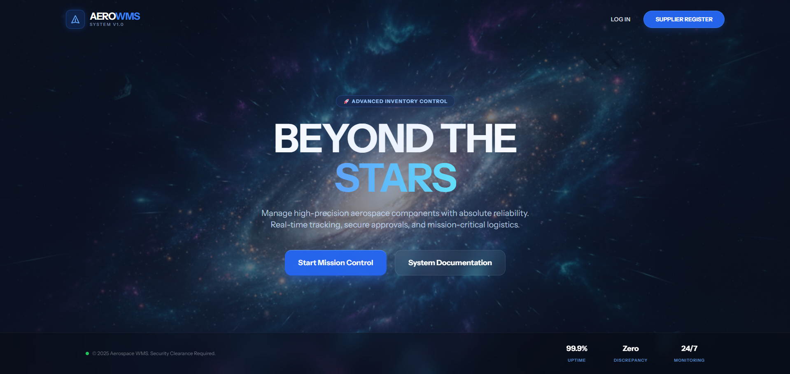

# 🚀 Aerospace WMS (Warehouse Management System)

Sistem Manajemen Gudang berbasis web yang dirancang khusus untuk industri komponen dirgantara (Aerospace). Dibangun menggunakan **Laravel 11**, **Breeze**, dan **Tailwind CSS** dengan arsitektur MVC yang kokoh.

 


## 📋 Daftar Isi
- [Tentang Proyek](#-tentang-proyek)
- [Fitur Utama](#-fitur-utama)
- [Teknologi](#-teknologi)
- [Instalasi & Setup](#-instalasi--setup)
- [Hak Akses (Role)](#-hak-akses-role)
- [Akun Demo](#-akun-demo)
- [Credits](#-credits)
  
## 🎯 Tentang Proyek
**Aerospace WMS** adalah solusi digital untuk mencatat, melacak, dan mengelola stok komponen pesawat (seperti *Turbine Blade, Avionics, Hydraulic Pump*) secara *real-time*. 

Sistem ini menerapkan **Multi-Role Access Control** yang ketat dan **Approval Workflow** berjenjang untuk menjamin keamanan dan akurasi data stok.

---
## 🌟 Fitur Utama

### 1. Multi-Role Access Control
Sistem memfasilitasi 4 peran pengguna dengan hak akses spesifik:
- **Admin**: Pengelola sistem penuh, manajemen user, dan master data kategori.
- **Warehouse Manager (Chief Engineer)**: Otoritas tertinggi operasional. Menyetujui transaksi keluar/masuk, membuat PO Restock, dan memantau stok kritis.
- **Staff Gudang (Teknisi)**: Operator lapangan. Mencatat transaksi masuk/keluar (Pending Approval) dan memperbarui stok fisik.
- **Supplier**: Mitra eksternal. Menerima dan mengonfirmasi pesanan Restock (PO).

### 2. Manajemen Inventori Cerdas
- **Real-time Stock Tracking:** Stok bertambah/berkurang otomatis berdasarkan transaksi yang disetujui.
- **Low Stock Alert:** Indikator visual dan notifikasi di dashboard jika stok mencapai batas minimum.
- **Digital Asset Tag:** Generate otomatis **QR Code** unik untuk setiap komponen berdasarkan SKU.

### 3. Transaksi & Validasi Ketat
- **Double-Layer Validation:** Staff input $\rightarrow$ Manager Approve. Stok tidak akan berubah sebelum disetujui.
- **Dynamic Input:** Bisa mencatat banyak item sekaligus dalam satu nomor transaksi.
- **Anti-Minus Logic:** Sistem menolak transaksi keluar jika jumlah yang diminta melebihi stok tersedia.

### 4. Restock Management (Procurement)
- Alur lengkap pengadaan barang: *Pending* $\rightarrow$ *Confirmed (by Supplier)* $\rightarrow$ *In Transit* $\rightarrow$ *Received*.
- Supplier Portal khusus untuk konfirmasi pesanan.

---

## 🛠️ Teknologi yang Digunakan

- **Framework:** Laravel 11
- **Database:** MySQL
- **Frontend:** Blade Templating + Tailwind CSS (Dark Aerospace Theme)
- **Authentication:** Laravel Breeze
- **Additional Libraries:**
    - `simplesoftwareio/simple-qrcode` (QR Code Generator)

---

## 🚀 Cara Instalasi

Ikuti langkah ini untuk menjalankan proyek di lokal:

1.  **Clone Repository**
    ```bash
    git clone [https://github.com/Haris2512/aerospace-wms.git]
    cd aerospace-wms
    ```

2.  **Instal Dependensi**
    ```bash
    composer install
    npm install
    ```

3.  **Setup Environment**
    - Copy file `.env.example` menjadi `.env`.
    - Konfigurasi database di file `.env`.
    ```bash
    cp .env.example .env
    php artisan key:generate
    ```

4.  **Migrasi & Seeding (PENTING)**
    Aplikasi ini menggunakan Seeder untuk membuat akun default.
    ```bash
    php artisan migrate:fresh --seed
    ```

5.  **Jalankan Server**
    ```bash
    npm run dev
    # Buka terminal baru
    php artisan serve
    ```

---

## 🔑 Akun Demo (Default Seeder)

Gunakan akun berikut untuk menguji setiap peran:

| Role | Email | Password |
| :--- | :--- | :--- |
| **Admin** | `admin@gudang.com` | `password` |
| **Manager** | `manager@gudang.com` | `password` |
| **Staff** | `staff@gudang.com` | `password` |
| **Supplier** | `boeing@supplier.com` | `password` |

---

## 📜 Aturan Bisnis (Business Logic)

1.  **Hapus Produk:** Produk tidak bisa dihapus jika masih memiliki sisa stok di gudang.
2.  **Edit Transaksi:** Hanya transaksi berstatus *Pending* yang bisa diedit atau dihapus oleh Staff.
3.  **Approval:** Hanya Manager yang bisa menyetujui transaksi untuk mengubah stok fisik.
4.  **Restock:** Supplier tidak bisa mengubah detail pesanan, hanya bisa *Confirm* atau *Reject*.

---

### 👨‍💻 Credits
Dikembangkan untuk **Tugas Final Praktikum Pemrograman Web 2025**.